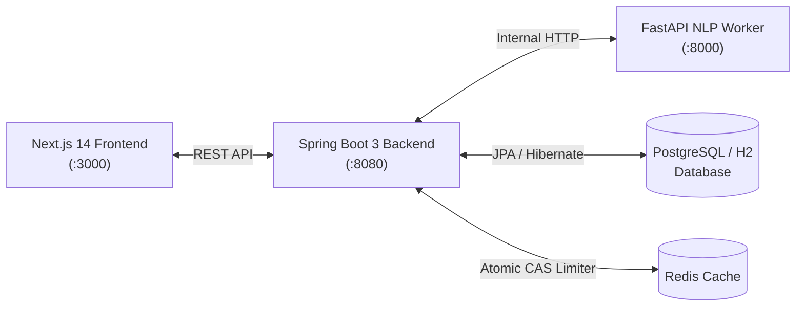

# CareerFlow

A full-stack ATS resume optimization and technical interview preparation platform built with **Next.js 14**, **Java 21 Spring Boot 3**, and **Python 3.12 FastAPI**.

> 🌐 **Live Web Application:** [https://careerflow-app.onrender.com](https://careerflow-app.onrender.com)  
> 📖 **Interactive API Docs (Swagger):** [https://careerflow-backend-narz.onrender.com/swagger-ui/index.html](https://careerflow-backend-narz.onrender.com/swagger-ui/index.html)  
> ⚡ **Quick Evaluation:** 1-Click Demo Login (`demo@careerflow.dev` / `demo123`)

---

## 📌 Motivation

When applying for software engineering internships and associate roles, candidates often face resume rejections from automated Applicant Tracking Systems (ATS) without understanding why. Common causes include unparsed multi-column layouts, missing keyword density from the target job description, or weak task-based bullet points.

I built **CareerFlow** to give candidates practical tools to improve their applications before submitting:
1. **Transparent ATS Scoring:** Get instant feedback on keyword match percentage and format compliance against real job descriptions.
2. **1-Page Formatted Resume Builder:** Build single-column, ATS-safe CVs with real-time A4 height overflow checks and Google XYZ bullet point rewriting.
3. **AI Mock Interview Simulator:** Practice 5 tailored technical and behavioral rounds with instant scoring, feedback, and senior model answers.
4. **Cloud Scan History & Drafts:** Track score improvements across multiple revisions and save reusable CV drafts.

---

## 🏗️ Architecture & Tech Stack

The application uses a decoupled microservices design:



| Layer | Technologies | Role |
| :--- | :--- | :--- |
| **Frontend** | Next.js 14 (App Router), React 18, Tailwind CSS, Lucide Icons | Responsive UI, live preview, state management |
| **Core Backend** | Java 21, Spring Boot 3, Spring Data JPA, Hibernate | REST gateway, candidate data persistence, rate limiting |
| **NLP Worker** | Python 3.12, FastAPI, Scikit-learn, Uvicorn | TF-IDF vectorization, Cosine similarity, interview evaluations |
| **Database & Cache** | PostgreSQL / H2 In-Memory, Redis | Audit records, user accounts, token-bucket rate limiter |
| **Testing** | JUnit 5, Pytest, Playwright | Unit, integration, and end-to-end test coverage (26 tests) |

---

## ✨ Features

- **Industrial ATS Resume Scanner (`/ats-checker`):**
  - Dual scoring: **Job Match %** and **ATS Format Health**.
  - Categorized missing skill chips (Languages, Frameworks, Databases, DevOps, Architecture).
  - Action verb audit and keyword frequency analysis.
  - 1-Click transfer to pre-populate the CV Builder with missing keywords.

- **1-Page Smart CV Builder (`/cv-builder`):**
  - Built-in ATS pre-flight checklist (page budget, contact completeness, single-column Taleo safety).
  - Google XYZ bullet optimizer (*Accomplished [X] as measured by [Y], by doing [Z]*).
  - Live print/PDF export and cloud draft saving.

- **AI Mock Interview Studio (`/interview-prep`):**
  - 5 targeted rounds: JVM Internals, System Architecture, Database Optimization, Fault Tolerance, and Google STAR behavioral scenarios.
  - Explains hiring manager intent for each question.
  - Scores answers (0–100%) with identified strengths, missing technical concepts, and senior model answers.

- **Candidate Dashboard (`/dashboard`):**
  - View historical ATS scan records and match score progress.
  - Save, reload, and manage multiple cloud CV drafts.
  - 1-Click demo login (`demo@careerflow.dev` / `demo123`) for quick evaluation without sign-up.

---

## 🚀 Getting Started

### Prerequisites
- **Git**
- **Docker & Docker Compose** (Recommended) *OR* local runtimes:
  - Java 21+ and Maven 3.9+
  - Python 3.12+
  - Node.js 18+ and npm

---

### Option 1: Run with Docker Compose (Recommended)

```bash
git clone https://github.com/SithumManusha/careerflow.git
cd careerflow
docker-compose up --build
```
Once started, open [http://localhost:3000](http://localhost:3000) in your browser.

---

### Option 2: 1-Click Windows Launcher

If you are on Windows, you can run the interactive batch script:
```cmd
run_project.bat
```
- Select **`0`** to start all 3 microservices concurrently in separate native command windows and open the browser automatically.

---

### Option 3: Run Services Individually

#### 1. Python NLP Worker (Port 8000)
```bash
cd worker-python
pip install -r requirements.txt
uvicorn app.main:app --host 0.0.0.0 --port 8000 --reload
```

#### 2. Java Spring Boot 3 Backend (Port 8080)
```bash
cd backend-java
mvn spring-boot:run
```

#### 3. Next.js 14 Frontend (Port 3000)
```bash
cd frontend
npm install --legacy-peer-deps
npm run dev
```

---

## 🧪 Running Tests

The project includes unit, integration, and E2E test suites:

```bash
# 1. Java Spring Boot Unit Tests (7 tests)
cd backend-java
mvn test

# 2. Python NLP & Interview Engine Tests (10 tests)
cd worker-python
pytest test_rag.py test_interview.py -v

# 3. Playwright End-to-End Tests (9 tests)
cd e2e-tests
npx playwright test
```

---

## ☁️ Deployment

- **Render Blueprint:** A ready-to-use `render.yaml` file is included in the root directory for 1-click deployment of the Frontend, Backend, and Worker.
- Detailed step-by-step instructions for deploying to free cloud tiers (Render, Vercel, Neon, Upstash) are available in [DEPLOYMENT_GUIDE.md](./DEPLOYMENT_GUIDE.md).

---

## 📄 License

This project is licensed under the MIT License - feel free to use and adapt it for learning or personal projects.
